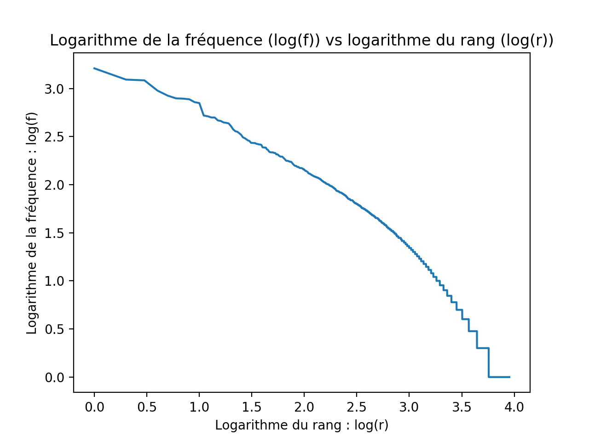
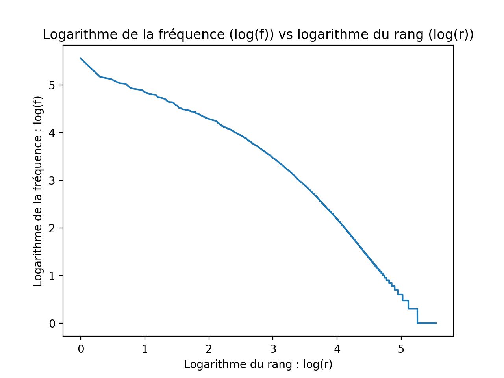
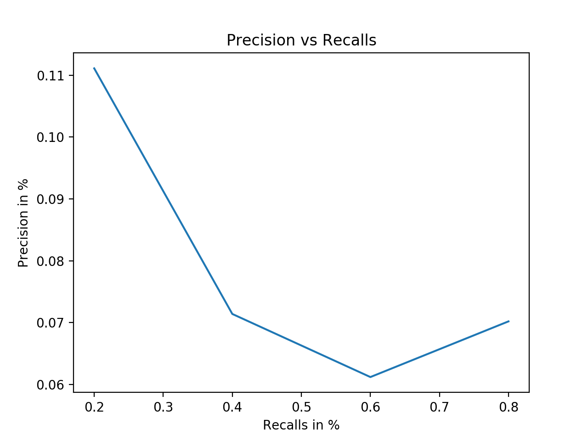
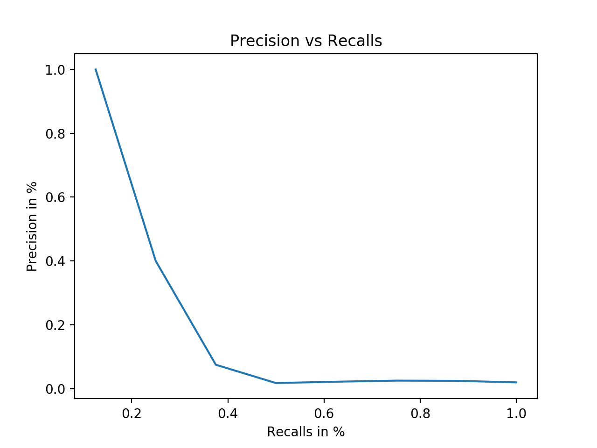
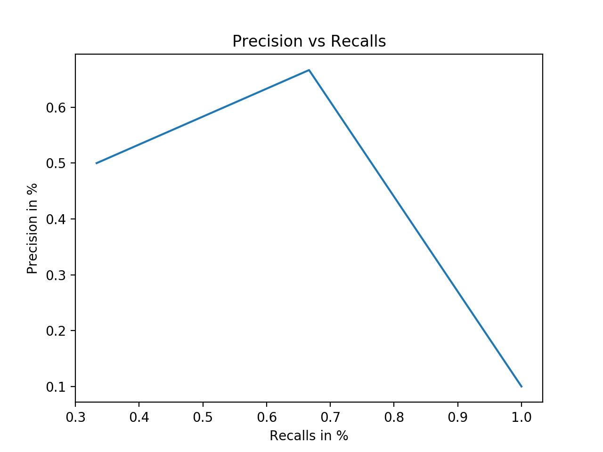
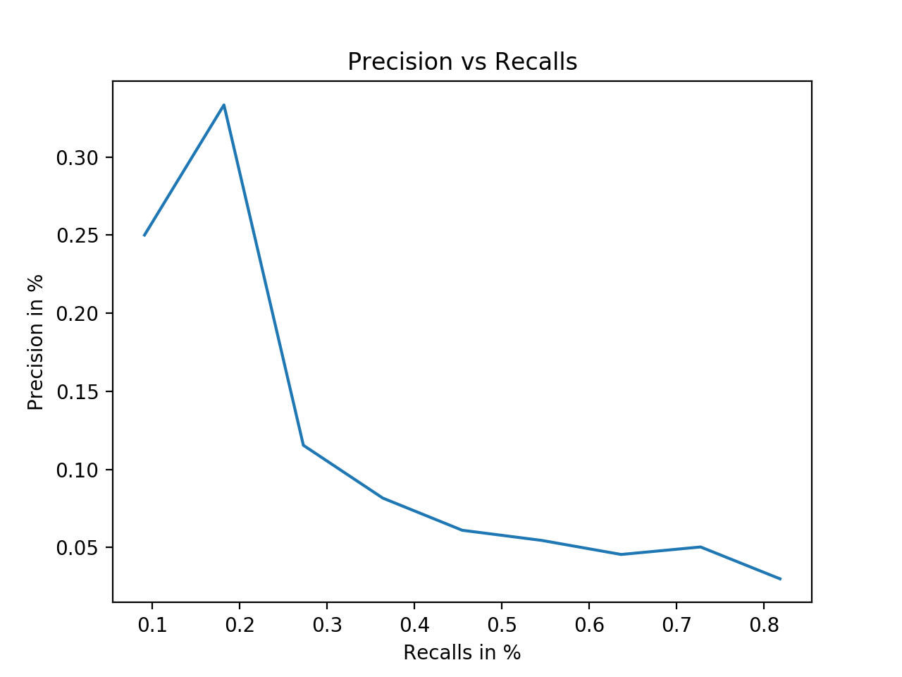

# Information Retrieval

Search engine for school project in IS3013AA (RI-W) at Centrale Supelec

### Table of contents: 
+ **[1. Getting Started](#1-getting-started)**
    + **[1.1 Prerequisites](#11-prerequisites)**
    + **[1.2 Build the linguistic treatment](#12-build-the-linguistic-treatment)**
    + **[1.3 Build the index](#13-build-the-index)**
    + **[1.4 Query search](#14-query-search)**
    + **[1.5 Evaluation](#15-evaluation)**
+ **[2. Rapport](#2-rapport-in-french)**
    + **[2.1 Traitements Linguistics](#21-traitements-linguistics)**
    + **[2.2 Création de l'index inversé](#22-création-de-lindex-inversé)**
    + **[2.3 Modèles de recherche](#23-modèles-de-recherche)**
        + **[Modèle booléen](#modèle-booléen)**
        + **[Modèle vectoriel](#modèle-vectoriel)**
    + **[2.4 Performances](#24-performances)**
    + **[2.5 Conclusion](#25-conclusion)**
+ **[3. Authors](#3-authors)**
+ **[4. License](#4-license)**

## 1. Getting started

### 1.1 Prerequisites

What things you need to install the software :
* Python3
* virtualenv

Run the script below to create your virtual env:
```
virtualenv ENV
```

Run the script below to activate your virtual env:
```
source ENV/bin/activate
```

Run the script below to download the requirements with pip:
```
pip3 install -r requirements.txt
```

Run the script below to deactivate your virtual env:
```
deactivate
```

Add the CACM and CS276 data collection in the `data/` folder :
- [data/CACM]()
⋅⋅* [cacm.all]()
⋅⋅* [common_words]()
⋅⋅* [qrels.text]()
⋅⋅* [query.text]()
- [data/CS276]()
⋅⋅* [pa1-data/0/...]()


### 1.2 Build the linguistic treatment

Use the [main_linguistic_treatment.py](main_linguistic_treatment.py) file to trigger the collections' terms tokenization.

You can add the following arguments:
* `-l <c>` : to get the linguistic treatment of the cacm or cs276 collection
* `-f <c>` : to get the linguistic treatment with vocabulary frequencies, of the cacm or cs276 collection
* `-h <c>` : to get heap parameters from the linguistic treatment for the cacm or cs276 collection
* `-g <c>` : to get the graph representation from the linguistic treatment of cacm or cs276

Example for cacm:
```
python3 main_linguistic_treatment.py -l cacm
```
Example for cs276:
```
python3 main_linguistic_treatment.py -l cs276
```

### 1.3 Build the index

Use the [main_index.py](main_index.py) file to build the collection's index.

You can add the following arguments:
* `-b <c>` : to build the collection's index and then save it into the folder [indexes/](indexes/)
* `-g <c>` : to get the collection's index from the [indexes/](indexes/) folder

Example for cacm:
```
python3 main_index.py -b cacm
```
Example for cs276:
```
python3 main_index.py -b cs276
```

### 1.4 Query search

Use the [main_search.py](main_search.py) file to search informations in the collections.

You can add the following arguments:
* `-bool <c>` : to do a boolean search in the collection c
* `-vect <c>` : to do a vectorial search in the collection c (cacm or cs276)
In both cases, you must have the indexes already saved in the [indexes/](indexes/) folder. To build them, use the following code ```python3 main_index.py -b cacm```

Example for cacm with the boolean search:
```
python3 main_search.py -bool cacm
```
Example for cs276 with the vectorial search:
```
python3 main_search.py -vect cs276
```
Here is how the interaction with the search engine appears for the boolean search:
```
##### Welcome to the CS Search Engine #####

# To type a request, use the following syntax :
# 'NOT (term1 OR term2) AND (term3 OR term4) AND NOT (term5 OR term6)'

# Type your request :
Algorithm AND Programming AND (Style OR Algebra)

# Results : 3 files found

# Showing 1 to 3 of 3 files

- DOC ID 3137 (points : 6): A Mathematical Programming Updating Method Using Modified Givens Transformations and Applied to LP Problems
- DOC ID 1913 (points : 5): Matrix Scaling by Integer Programming (Algorithm 348 [F1])
- DOC ID 1869 (points : 3): Some Techniques for Using Pseudorandom Numbers in Computer Simulation

################################################################################

# Do you want to type a new request ? y/n

```

### 1.5 Evaluation

To evaluate the information retrieval model, you can either display some precision/recall graph or ask the code to calculate the MAP (Mean Average Precision) value. Use the [main_evaluation.py](main_evaluation.py) to do so.

Here are the arguments you have to add
* `-g ` : to get the precision and recall graph for all the queries from cacm/query.text
* `-gb ` : to build the index and then get the precision and recall graph for all the queries from cacm/query.text
* `-m ` : to get the MAP (Mean Average Precision) value for cacm

Example:
```
python3 main_evaluation.py -g
```

And to get the MAP:
```
python3 main_evaluation.py -m
```

## 2. Rapport (in French)

### 2.1 Traitements Linguistics

Les fichiers correspondants au traitement linguistique des deux collections (CACM et CS276) dont les suivants:
- [main_linguistic_treatment.py](main_linguistic_treatment.py) : permet de lancer le traitement linguistique en ligne de commande
- [linguistic_treatment.py](linguistic_treatment.py) : permet de construire les tokens ainsi que le vocabulaire (avec ou sans term_frequency) pour chacune des deux collections.

Voici les résultats de la tokenisation de CACM et CS276 :

| Collection    |   CACM  |    CS276    |
|---------------|---------|-------------|
| Tokens        | 222 373 |  25 498 340 |
| Vocabulary    |   8 976 |     346 650 |
| Half tokens   | 111 186 |  12 749 170 |
| Half vocab    |   6 393 |     177 266 |
| Heap param k  |  21.641 |    0.023639 |
| Heap param b  | 0.48958 |     0.96756 |
| Voc (1Million)|  18 738 |      15 100 |

#### Graphes fréquence (f) vs rang (r) :
- CACM :
 vs rang (r)")
- CS276 :
 vs rang (r)")

#### Graphes logarithme de la fréquence (log(f)) vs logarithme du rang (log(r)) :
- CACM :

- CS276 :



### 2.2 Création de l'index inversé

#### Choix d'implémentation et stratégie utilisée
Pour représenter un index (CACM ou CS276), j'ai choisi d'implémenter une classe Index dont allait hérité les deux classes CACMIndex et CS276Index.

Chaque classe possède les propriétés suivantes :
```
self.collection_name = collection_name
self.doc_ids = {}     # { doc_id : doc } : dictionnaire de (document_id, document)
self.term_ids = {}    # { term_id : term } : dictionnaire de (terme, terme_id)
self.index = {}       # { term_id : [(doc_id_0, freq_0), ..., (doc_id_10, freq_10)] } : liste de postings pour chaque terme_id
```

La collection CACM a été considérée comme un seul bloc, en revanche, pour CS276, j'ai considéré chaque sous répertoire du dossier pa1-data comme un bloc.

La création de l'index de CACM se déroule ainsi:
- Création du dictionnaire de (terme, terme_id) à partir du traitement linguistique fait précédemment : `self.term_ids`
- Parcours de tous les documents :
⋅⋅* Attribution d'un document_id
⋅⋅* Ajout dans l'index `self.index` du tuple (document_id, frequency)  pour tous les term_id présents dans le document
- Sauvegarde de l'index, et des dictionnaires de (document_id, document) et (terme, terme_id) dans [indexes/cacm/](indexes/cacm/)

La création de l'index CS276 se déroule de la façon suivante :
- Création du dictionnaire de (terme, terme_id) à partir du traitement linguistique fait précédemment : `self.term_ids`
- Parcours de tous les blocs (10 en tout) :
⋅⋅* Création de l'index de ce bloc (même méthode que pour CACM)
⋅⋅* Sauvegarde de cet index dans le dossier [indexes/cs276/temporary/](indexes/cs276/temporary/)
- Fusion des index des 10 blocs enregistrés dans le dossier [indexes/cs276/temporary/](indexes/cs276/temporary/)
⋅⋅* Fusion de deux index, par exemple: `index_0.txt` et `index_1.txt`
⋅⋅* Sauvegarde temporaire de l'index fusionné : `index_01.txt`
⋅⋅* Recommencer jusqu'à ce qu'il n'y ait plus qu'un seul index.
- Sauvegarde de l'index final dans le dossier [indexes/cs276/](indexes/cs276/)
- Le dictionnaire de (document_id, document) est mis à jour régulièrement et sauvegardé à la fin dans le même dossier

#### Performances
Les performances détaillées de création des deux index (CACM et CS276) sont enregistrées ici:
- [results/cacm_cProfile.txt](results/cacm_cProfile.txt)
- [results/cs276_cProfile.txt](results/cs276_cProfile.txt)

| Collection | Durée de création | Taille de l'index |
|------------|-------------------|-------------------|
|    CACM    |     1.779 seconds |             1.1 Mo|
|    CS276   |   129.393 seconds |            79.4 Mo|


### 2.3 Modèles de recherche

Deux modèles de recherche ont été implémentés : le modèle booléen et le modèle vectoriel. Pour cefaire, j'ai utilisé une classe Search dont allait hérité les classes BooleanSearch et VectorialSearch.

#### Modèle Booléen
Pour le modèle booléen, la requète doit être une forme normale conjonctive :
```NOT (x1 OR x2) AND (x3 OR x4 OR x5) AND NOT (x6 OR .. OR xn)```

Une fois que l'utilisateur a tapé sa recherche, celle-ci est convertie en deux tableaux `positive_clauses` et `negative_clauses` qui rassemblent les clauses positives et les clauses commençant par un `NOT`. Ensuite, pour chacun des deux tableaux de clauses, une fonction `get_postings(clauses)` détermine la liste des documents pertinents. Le résultat final est obtenu en retirant de la liste positive_postings tous les documents présents dans la liste negative_postings.

#### Modèle Vectoriel
Pour le modèle vectoriel, la requête peut prendre n'importe quelle forme. Dans un premier temps, la requête est transformée en une liste de term_ids appelé `request_term_ids`. À partir de cette liste, je récupère la liste de tous les documents qui contiennent au moins un terme de la liste. Après avoir constitué cette liste de `doc_ids`, je calcule pour chaqun des termes le document_frequency (df) ainsi que le term_frequency (pour chaque document de `doc_ids`). Après quoi, je calcule le poids d'un terme dans un document en utilisant la méthode TF-IDF. (Les autres méthodes n'ont pas été implémentées pour le moment). Une fois les poids déterminés, je calcule le score (ici appelé similitude) d'un document par rapport à la requête, en utilisant la fonction `get_similitudes`.

### 2.4 Performances
Évaluation pour la collection CACM :

Voici quelques exemples de courbes de rappel obtenues.
- _What articles exist which deal with TSS (Time Sharing System), an
operating system for IBM computers?_

- _I'd like papers on design and implementation of editing interfaces,
window-managers, command interpreters, etc.  The essential issues are
human interface design, with views on improvements to user efficiency,
effectiveness and satisfaction._

- _Interested in articles on robotics, motion planning particularly the
geometric and combinatorial aspects.  We are not interested in the
dynamics of arm motion._

- _Optimization of intermediate and machine code_


De plus, voici la valeur du Mean Average Precision (MAP) que j'ai obtenu:

| Mesure| Valeur |
|-------|--------|
|  MAP  | 0.2197 |

### 2.5 Conclusion

Voici les pistes d'amélioration possibles :
- ajouter différents poids au modèle vectoriel (seul tf-idf a été implémenté)
- calculer plus précisément le score d'un document étant donné une requête : des approximations ont été faites dans mon code (notamment pour tout ce qui concerne le calcule de la norme d'un document ici approximée à 1)
- implémenter une recherche par probabilité

## Authors
* Melanie Berard

## License
This project is licensed under the MIT License - see the [LICENSE.md](LICENSE.md) file for details